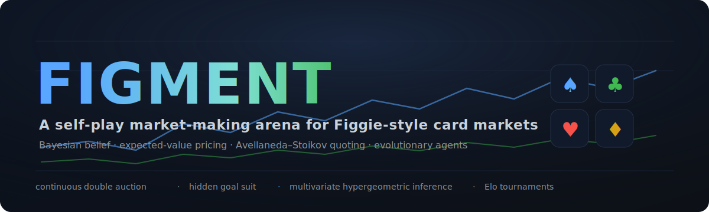
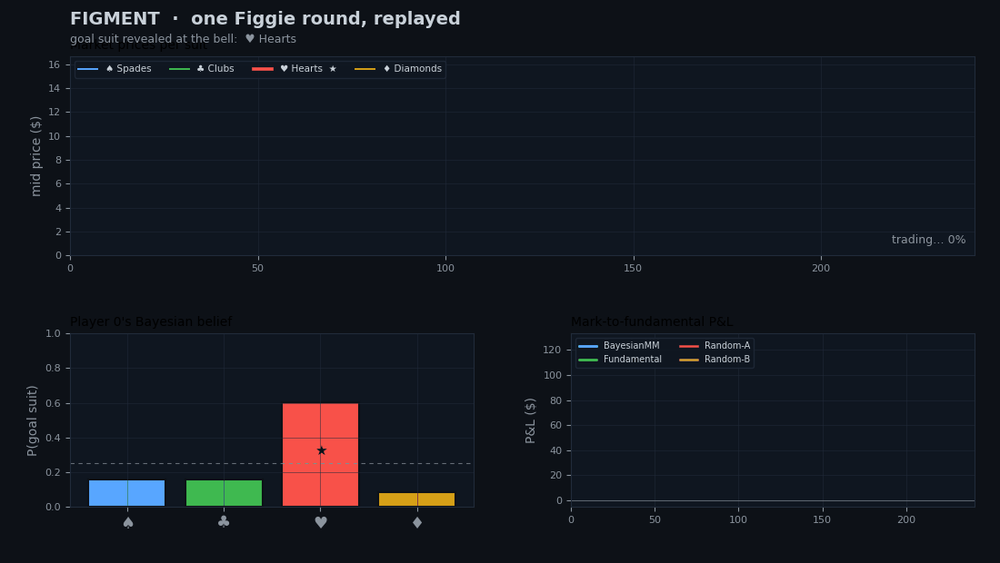
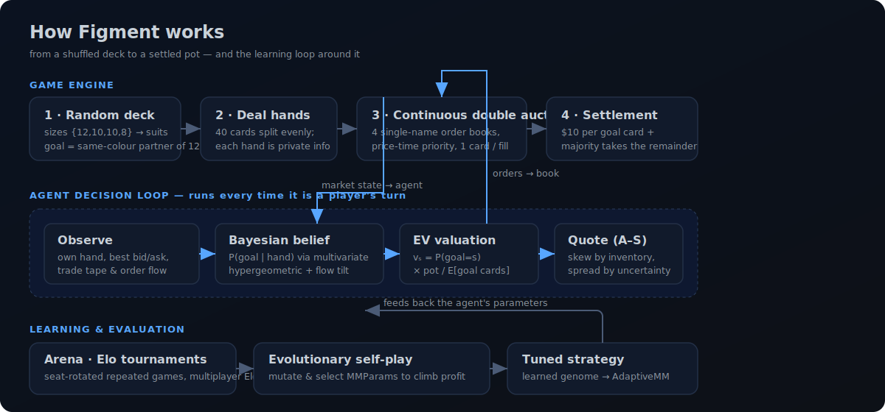
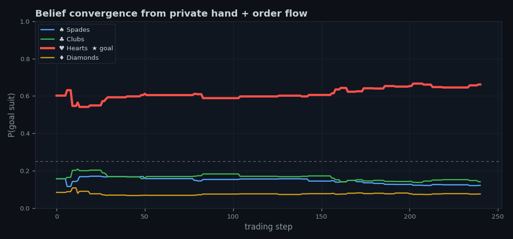
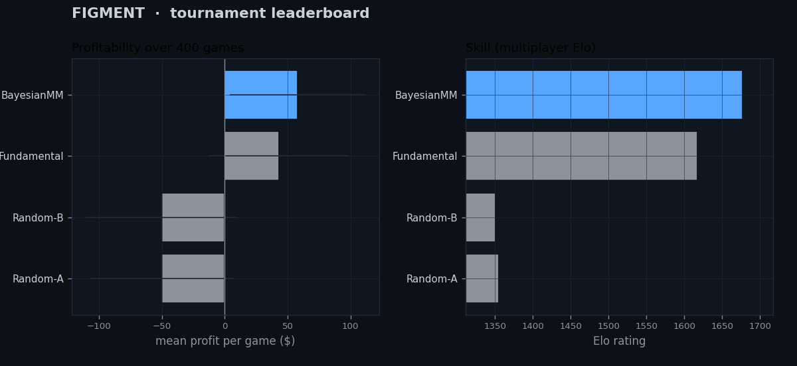
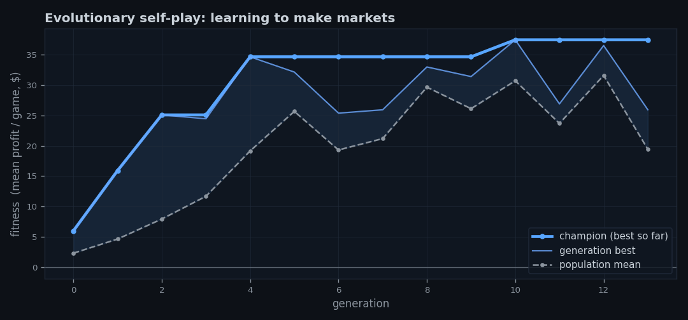

<p align="center">
  
</p>

<p align="center">
  
  
  
  
  
</p>

<p align="center"><b>
♠ Figgie is the trading card game invented by Jane Street. ♥<br>
Figment is a from-scratch engine for it, plus AI traders that infer a hidden truth from prices and learn to make markets. ♦
</b></p>

---

## The one-paragraph version

Deal a 40-card Figgie deck and one suit is secretly the **goal suit** — hold the most of it when the bell rings and you take the pot. Nobody is told which suit it is. **Figment** simulates the whole thing: a continuous double-auction market with four order books, a family of trading agents, and — the fun part — a **Bayesian market maker** that infers which suit scores from its private hand and the order flow it sees, prices every card at its expected value, and quotes a two-sided market with inventory-aware spreads. Then a tournament ranks the agents by Elo, and an evolutionary loop *learns* a market-making strategy from scratch. Everything is pure Python + NumPy, deterministic under a seed, and covered by tests that assert the market never creates or destroys a card or a dollar.

<p align="center">
  
</p>

<p align="center"><sub>
One real round, replayed — top: mid-price of each suit; bottom-left: the market maker's posterior over the goal suit updating live; bottom-right: mark-to-fundamental P&L. The ★ marks the suit that actually scores.
</sub></p>

---

## Why I built this

I wanted a project that lives where I want to work: **markets, probability, and decision-making under uncertainty.** Figgie is perfect for it — it's small enough to simulate exactly, but it contains a real market microstructure problem in miniature: *price discovery of a hidden fundamental, under adverse selection, with inventory risk.* So I built the game honestly, then built agents that have to **reason** rather than pattern-match:

- A **hidden-state inference** problem solved with an exact posterior, not a black box.
- **Expected-value pricing** derived from the game's payout structure.
- A **market-making policy** (Avellaneda–Stoikov flavoured) that trades off spread capture against inventory and belief risk.
- A **self-play optimiser** that discovers good market-making parameters without being told them.

No neural network mysticism, no scraped dataset — just a clean, testable model of how a market finds the truth. It runs in seconds on a laptop and every number in this README is reproducible with one command.

---

## How it works

<p align="center">
  
</p>

### 1 · The game (exactly to the real rules)

| Rule | Figment |
|---|---|
| Deck | 40 cards; suits get a random permutation of sizes `{12, 10, 10, 8}` |
| Goal suit | always the **same-colour partner of the 12-card suit** (so it holds 8 or 10 cards) |
| Trading | continuous double auction, four independent order books, price-time priority |
| Payout | **$10 per goal card** you hold, and the **majority holder takes the rest** of the $200 pot (ties split) |

The engine enforces the physics of a real market: you can't sell a card you don't hold, you can't bid more cash than you have, and **cards and cash are conserved on every single fill** — a property the test suite checks across thousands of randomized games.

### 2 · Inferring the hidden goal suit (the interesting math)

A deck is one of exactly **12 equally likely** size-assignments (choose the 12-suit, then the 8-suit; the rest are 10s). Your private hand `h` is a sample *without replacement* from the true suit populations, so the likelihood of a hypothesised assignment `n = (n_0,…,n_3)` is the **multivariate hypergeometric** — and because the normaliser is constant across hypotheses, the posterior collapses to a product of binomials:

$$
P(n \mid h)\;\propto\;\prod_{s}\binom{n_s}{h_s}, \qquad
P(\text{goal}=k)\;=\;P\big(\text{common}=\text{partner}(k)\big).
$$

Intuition the model gets for free: **the suit you hold *most* of is probably the 12-card common suit — which means its partner, not itself, is probably the goal.** The market maker also folds in *order flow*: aggressive buying of a suit is weak evidence that suit scores, so beliefs sharpen as trading reveals what others privately hold.

<p align="center">
  
</p>

### 3 · Pricing and quoting

With the posterior in hand, each card has a risk-neutral fair value, and the maker quotes around it Avellaneda–Stoikov style — skewing its mid against inventory so it naturally sheds risk, and widening its spread when it is *uncertain* (high posterior entropy) or when the close is far away:

$$
v_s = P(\text{goal}=s)\cdot\frac{\text{pot}}{\mathbb{E}[\text{goal cards}]},\qquad
r_s = v_s - \gamma\,(q_s-\bar q),\qquad
\delta = \big(\delta_0 + \lambda\,H(p)\big)\big(1-\tau\,\tfrac{t}{T}\big).
$$

It rests a bid at $r_s-\delta$ and an ask at $r_s+\delta$, and **crosses to take** any resting order mispriced by more than its edge threshold. (Here $\mathbb{E}[\text{goal cards}]=\tfrac{28}{3}\approx 9.33$, which falls out of the rules — a nice closed-form detail.)

---

## Results

Everything below is regenerated by `python -m figment.cli demo`.

### The market maker wins on *edge*, not luck

Four hundred seat-rotated games, four agents:

<p align="center">
  
</p>

| Agent | Elo | Profit / game | Goal-suit win % |
|---|--:|--:|--:|
| **BayesianMM** — belief + A–S quoting | **1677** | **+$57.9** | 20.3% |
| Fundamental — value taker | 1617 | +$42.9 | 19.0% |
| Random-A — noise trader | 1355 | −$50.4 | 30.7% |
| Random-B — noise trader | 1351 | −$50.4 | 30.0% |

The punchline is in the last two columns: the noise traders actually **win the pot more often** — they blindly hoard goal cards — yet they **lose money every game**, because they overpay for them. The market maker wins less often but profits consistently by buying goal cards below value and earning the spread. *Outcome ≠ edge.* That distinction is the whole game.

### Learning to make markets from scratch

Seed a population of market makers in a deliberately **timid** corner of parameter space — huge spreads, a giant take-edge, so they barely trade and barely profit (**$6/game**) — then let evolution select on profit against a fixed benchmark field. Over 14 generations the champion climbs to **$37/game**, discovering on its own that timid quoting leaves money on the table:

<p align="center">
  
</p>

| Parameter | Timid start | Evolved champion | What it learned |
|---|--:|--:|---|
| `base_spread` | 7.5 | **2.0** | quote *tight* — capture more flow |
| `take_edge` | 7.5 | **0.7** | take aggressively when mispriced |
| `risk_aversion` | 3.2 | **0.0** | inventory is fine when your read is good |
| `uncertainty_weight` | 0.3 | **1.5** | but *do* widen when the posterior is fuzzy |
| `time_pressure` | 0.9 | **0.7** | and tighten into the close |

---

## Quickstart

```bash
git clone https://github.com/mneha05/figment.git
cd figment
pip install -e ".[dev]"      # numpy, matplotlib, pillow (+ pytest, ruff)

python -m figment.cli play             # play one round, see the settlement
python -m figment.cli tournament       # run an Elo tournament
python -m figment.cli evolve           # evolve a market maker via self-play
python -m figment.cli demo             # regenerate every chart + the GIF above
```

```text
$ python -m figment.cli play

Deck sizes  : ♠12  ♣10  ♥10  ♦8
Common suit : ♠ Spades (12 cards)
GOAL suit   : ♣ Clubs (10 cards)

agent           goal cards    profit ($)
----------------------------------------
BayesianMM               3          32.0
Fundamental              1          -3.0
Random-A                 2         -41.0
Random-B                 4          12.0

Trades executed: 27   (zero-sum check: +0.00)
```

### Use it as a library

```python
from figment import play_game, GameConfig, posterior_goal
from figment.agents import BayesianMarketMaker, FundamentalAgent, RandomAgent

agents = [BayesianMarketMaker(), FundamentalAgent(), RandomAgent(), RandomAgent()]
result = play_game(agents, GameConfig(seed=7))

print(result.deck.goal_suit, result.profits)      # who made money
print(posterior_goal(result.hands_start[0]))      # player 0's opening read
```

---

## What's under the hood

```text
figment/
├── cards.py          # suits, colours, the {12,10,10,8} deck, dealing
├── belief.py         # hypergeometric posterior over the goal suit + EV valuation
├── engine.py         # order books, continuous double auction, settlement, P&L
├── agents/
│   ├── random_agent.py   # noise trader (liquidity)
│   ├── fundamental.py    # value taker: trades only on a clear edge
│   ├── market_maker.py   # Bayesian + Avellaneda–Stoikov market maker  ← the star
│   └── adaptive.py       # the same maker, with an evolvable genome
├── elo.py            # multiplayer Elo (all pairwise duels per game)
├── arena.py          # seat-rotated tournaments + aggregate stats
├── evolve.py         # evolutionary self-play parameter search
├── viz.py            # dark-themed charts + the animated replay
└── cli.py            # play · tournament · evolve · demo

tests/                # 15 tests: card/cash conservation, settlement math,
                      # matching semantics, belief correctness, zero-sum P&L
```

```bash
pytest -q          # 15 passing
ruff check .       # linted
```

The tests aren't decoration — they pin down the parts that are easy to get subtly wrong: that settlement always pays out **exactly the pot**, that a crossing order fills at the **resting** price, that a hand full of one suit implies its *partner* is the goal, and that profit is **zero-sum** in every game.

---

## Roadmap

- [ ] A deep-RL agent (policy-gradient over the same observation) to race against the hand-derived maker
- [ ] Belief over opponents' *hands*, not just the goal suit — model who is short what
- [ ] A live terminal UI to play a hand against the bots yourself
- [ ] 5-player games and asymmetric antes
- [ ] Latency / queue-position modelling in the matching engine
